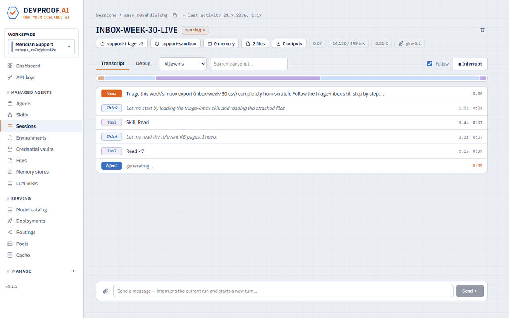
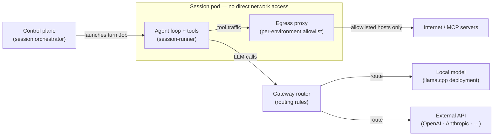
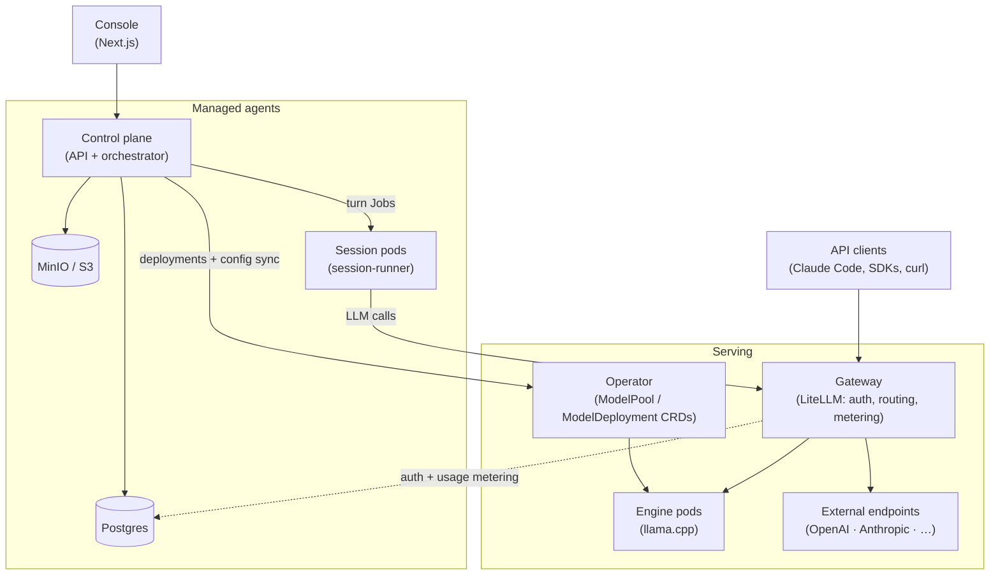
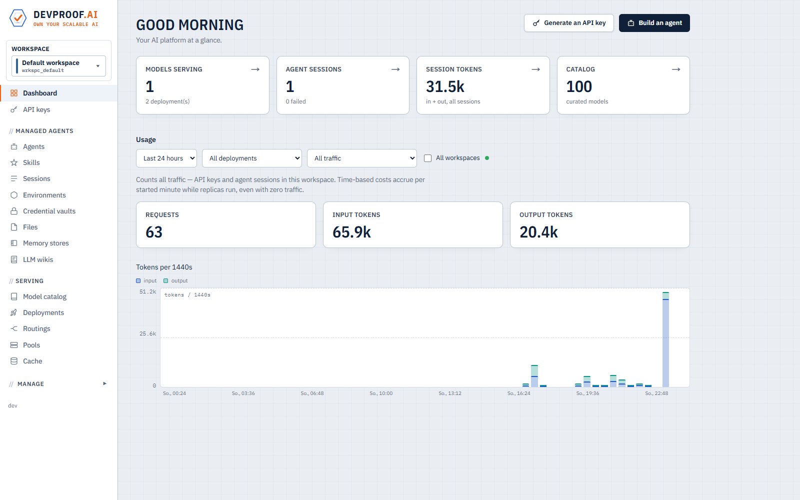
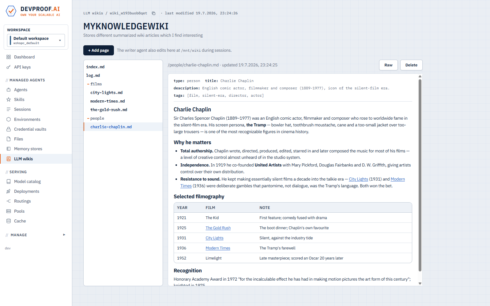
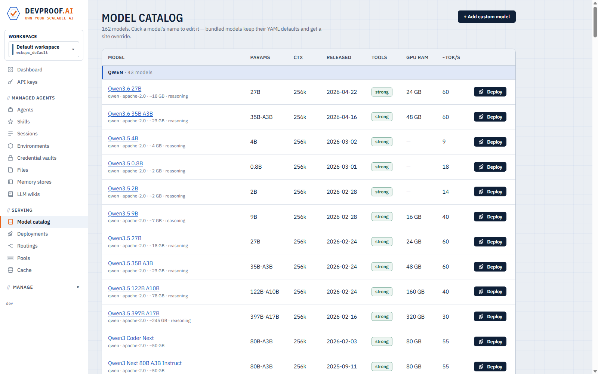
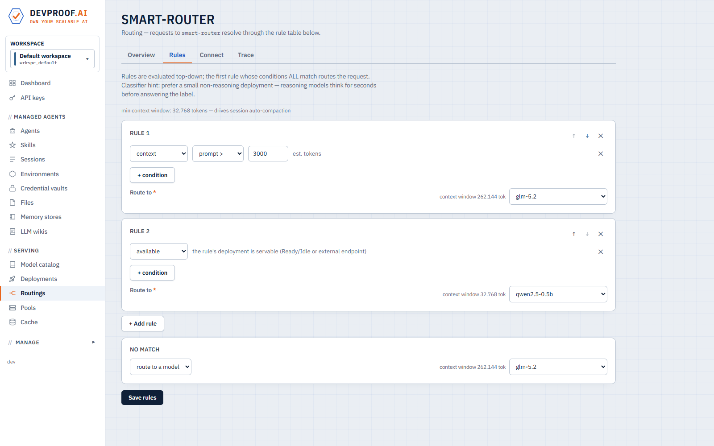
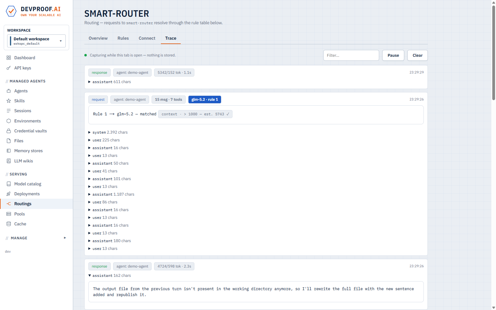

# DEVPROOF.AI

**Own your scalable AI.** Self-hosted LLM serving + managed agents on Kubernetes.

Run open models and autonomous agents on infrastructure you control. One Helm
install gives you two planes on your own cluster: a **serving plane** (curated model catalog, one-click deployments,
autoscaling, OpenAI- & Anthropic-compatible endpoints) and a **managed-agents
plane** (Anthropic-style agent sessions with tools, skills, memory, wikis and
credential vaults — running against the models you just deployed, or any
external API).

## Features

### Managed agents — with any LLM

Define an agent once (model routing, system prompt, tools, skills, environment,
credentials); the platform runs thousands of sessions of it. Every turn
executes as an isolated per-session Kubernetes pod that **idles to zero**
between messages — sessions checkpoint, resume, interrupt, and survive pod
failures. Agents work like Anthropic's managed agents, but pointed at models
you control — local deployments or external APIs (OpenAI, Anthropic,
OpenRouter, custom endpoints), switchable per request.



*An agent session, recorded live — the transcript grows with every thought and
tool call, tokens and cost tick in real time, the agent delegates to a second
agent, and the finished result opens as rendered markdown.*

- **Managed subagents.** Agents can delegate work to other agents: a parent
  spawns a full child session via the built-in `Delegate` tool, follows up on
  it across turns, collects its output files, and locks it when done.
- **Traceability.** Every step is on the record: a live session transcript of
  every message, thought and tool call; per-request gateway traces showing
  which routing rule fired and the exact wire messages; token metering per
  session, key, agent and workspace.
- **Easy development.** Create an agent in the console in a minute — pick a
  routing, an environment and a prompt. Versioned skills (progressive
  disclosure), memory stores, file attachments and a Python client
  round out the workflow.
- **Secured environments.** Sessions get no network egress unless their
  environment allowlists specific hosts (per-environment proxy +
  NetworkPolicy). Secrets live in credential vaults, injected as pod-level
  placeholders — they never ride the job spec and are never shown to the
  model. Everything is workspace-scoped for multi-tenancy.

### LLM wikis & knowledge management

Hierarchical knowledge bases that agents mount as files — with a catalog
`index.md`, one page per topic, and an append-only change log. Any number of
agents can read a wiki; exactly **one** agent is its maintainer (writer), and
writer sessions run serialized so wiki writes never race. Reader agents report
gaps to the maintainer by delegation, and the maintainer keeps the corpus
current — knowledge management as an agent workflow, not a database chore.

### Dynamic routing — local and remote models

Routings are rule tables evaluated per request at the gateway: route by prompt
size, spend or token budgets, availability, time of day, traffic split, or
even a model-based classifier — with a terminal route or reject. A single
routing name can front "small prompts go to the local model, big contexts
burst to the cloud, reject when the budget is gone," and agents as well as
external API traffic resolve through it. The live trace shows every decision —
which rule matched, the evaluated values, the resolved target, and the full
request/response.

### Cost management — for APIs and managed agents

Two ledgers, cleanly separated: **real** costs (infra time and external-API
tokens, priced at usage time) and **billed** costs (what you charge your
consumers, metered per started minute with idle-to-zero sessions). Token
totals tick live mid-turn; usage is attributable to workspaces, API keys,
agents, routings and sessions; and routing rules can enforce cost or token
budgets automatically.

### Own, scalable serving

A curated catalog of 160+ open models (plus your own from Hugging Face, an
internal registry, or any URL) with hardware requirements shown before you
deploy. One click provisions a pool-scheduled deployment served by llama.cpp —
CPU or GPU — behind a LiteLLM gateway that speaks the **OpenAI and Anthropic
APIs**. Deployments autoscale on live engine throughput, **sleep to zero
replicas** when idle and wake on the first request; the whole platform is
designed to scale to hundreds of pods. Your existing stack — Claude Code, the
OpenAI SDK, LangChain — switches to self-hosted models by changing one line:
the base URL.

## Quick start (local Kubernetes)

Runs on any small cluster — Docker Desktop's built-in Kubernetes is enough
(the catalog includes 1–3 GB CPU-runnable models for exactly this).

Prerequisites: a Kubernetes cluster with a default StorageClass,
`kubectl`, Helm 3.8+.

```bash
# One umbrella chart deploys everything: control plane, console, gateway,
# operator, Postgres, MinIO:
helm install devproof oci://ghcr.io/devproof/devproofai-helm -n devproof --create-namespace

# Don't want to serve local models? Install without the LLMkube serving
# engine — agents, routing, API keys and metering then run purely against
# external APIs (OpenAI, Anthropic, OpenRouter, custom), added later in the
# console under Deployments -> Add endpoint:
helm install devproof oci://ghcr.io/devproof/devproofai-helm -n devproof --create-namespace --set llmkube.enabled=false

# Wait for the pods, then expose the console and the model gateway:
kubectl -n devproof get pods
kubectl -n devproof port-forward svc/console 7090:7090 &
kubectl -n devproof port-forward svc/gateway 14000:4000 &
```

Open **http://localhost:7090** and:

1. **Pools** → create a pool (GPU type `cpu` works on a laptop cluster), then
   **Model catalog** → pick a small model (e.g. *Qwen 2.5 0.5B Instruct*) →
   **Deploy** into it. Watch it download and turn Ready. (Installed without
   LLMkube? Skip this — add your provider under **Deployments** → *Add
   endpoint* instead.)
2. **Routings** → create a routing that routes to your deployment (agents and
   API keys always talk to routings, not raw deployments).
3. **API keys** → create a key, then point any OpenAI/Anthropic client at it:

   ```bash
   curl http://localhost:14000/v1/chat/completions \
     -H "Authorization: Bearer dpk_..." -H "Content-Type: application/json" \
     -d '{"model":"my-routing","messages":[{"role":"user","content":"Hello!"}]}'

   # or run Claude Code against your own cluster:
   ANTHROPIC_BASE_URL=http://localhost:14000 ANTHROPIC_AUTH_TOKEN=dpk_... \
     claude --model my-routing
   ```

4. **Environments** → create one (egress allowlist), **Agents** → create an
   agent on your routing, **Sessions** → give it a task and watch the
   transcript stream.

If your registry pulls fail (the `ghcr.io/devproof/*` packages require auth in
your setup), pass a token: `--set registryAuth.token=<PAT with read:packages>`.
More install options (external Postgres/S3, exposure, scheduling):
[`helm-charts/README.md`](helm-charts/README.md).

## Python client

Everything above is scriptable with the Python client
([`python-client/`](python-client/README.md), Apache-2.0,
`pip install devproofai-client`):

```python
from devproof import Devproof

client = Devproof(base_url="https://gateway.example.com", api_key="dpk_...")

env = client.environments.create(name="my-env")
agent = client.agents.create(name="my-agent", routing="my-routing", environment_id=env["id"])
session = client.sessions.create(agent=agent["id"], prompt="Hello!")
for event in client.sessions.events.stream(session["id"]):
    print(event)
```

Runnable examples for every feature area — files, skills, memory, wikis,
vaults, environments, agents, sessions, tool use, MCP — live in
[`python-client/examples/`](python-client/examples/README.md).

## AI sovereignty

Running models and agents on your own infrastructure keeps access, cost,
availability and data under your control. Open-weight models (GLM, Llama,
Qwen, DeepSeek, …) have closed most of the capability gap with closed APIs —
what's left is the operational work of serving them and running agent
workloads on top. DEVPROOF.AI packages that into one Kubernetes platform:
serving, agents, routing and metering, self-hosted and multi-tenant.

## Architecture

**Agent execution flow** — every turn runs in an isolated, network-locked
session pod; all model traffic resolves through the gateway's routing rules:



**Component dependencies** — the managed-agents plane and the serving plane,
meeting at the gateway:



| Path | What |
|---|---|
| `operator/` | Go operator — `ModelPool`/`ModelDeployment` CRDs, autoscaler, scale-to-zero |
| `control-plane/` | Node/TS platform API + session orchestrator (Fastify, Postgres) |
| `console/` | Next.js management console |
| `gateway/` | LiteLLM-based model gateway image (auth, metering, routing hooks) |
| `session-runner/` | Agent session pod: in-process agent loop, tools, checkpoints |
| `catalog/` | Bundled model + MCP-server catalogs |
| `helm-charts/` | The umbrella Helm chart (single deploy source of truth) |
| `python-client/` | Python client (Apache-2.0, on PyPI as `devproofai-client`) |

Building from source: [`BUILD.md`](BUILD.md). Concept and decision history:
[`docs/concept/`](docs/concept/).

## Screenshots

The dashboard — models serving, agent sessions and live token usage at a
glance:



An LLM wiki — a hierarchical knowledge base with one maintainer agent and any
number of readers, browsable in the console:



The model catalog — 160+ curated open models with hardware requirements,
one-click deploy:



A routing rule table — small prompts stay on the local model, large contexts
burst to a cloud endpoint:



The live gateway trace — every request with the rule that matched, the
evaluated values, and the wire messages:



## License

The platform is source-available under the [Elastic License 2.0](LICENSE): you
may use, copy, modify, and self-host it (including commercially), but you may
not provide it to third parties as a hosted or managed service.

The Python client (`python-client/`) is open source under the
[Apache License 2.0](python-client/LICENSE), so it can be embedded freely in
your own products.
